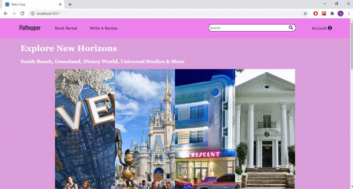

# lodgeworkspace

# Premise

Website to book short-term and affordable lodging.

# Installation
## For Backend
- $cd backendlodgeworkspace
- $bundle install
- $rails s

Keep the terminal running backend and open another terminal

## For Frontend
- $cd frontendlodgeworkspace
- $npm install
- $npm start